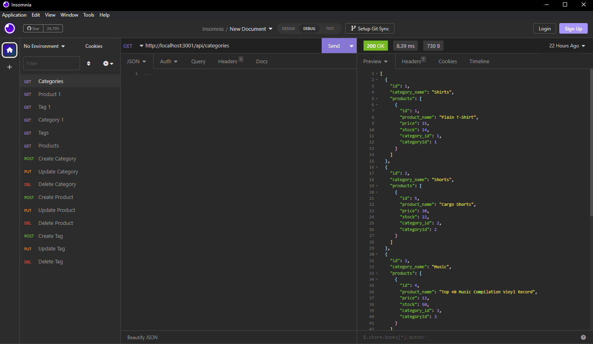

# E-Commerce Backend Tool 

Creating a tool that can be used for online retail sales and transactions as well as inventory cataloging. This tool is very modular in the way it can be applied to many different retail industries and has and extreme adavanage because it is capable of hosuing large amounts of data.

## Table of Contents

- [Description](#description)
- [Technology](#Technology)
- [Installation](#installation)
- [Usage](#usage)
- [License](#license)
- [Author](#Author)

## Description:

Showcasing the backend capabilities of a retail wbsite or marketplace that is dealing with inventory and pricing. The video demo below shows the usuage of the application and how it can pull data, updata data, delete, and get items by id. Follow the installation guide below to try this app for yourself! 

## Technology:

Project is created with:

- Javascript
- Node.js
- Express.js
- MySQL
- Insomnia

## Installation

Copy the repository into your own folder. 

Requirements: You must have MySQL downloaded and setup on your device for the database to be created, and hosted.

To run this project, install it locally using npm:

```
npm install
```

## Usage

After installing npm packages, the application will be invoked by using the following command:

```
npm start
```

#### Video Demo

[Click me to see the demo video!](https://www.youtube.com/watch?v=A60SmP33ZgY)

#### Insomnia Screenshot



## License

[](https://opensource.org/licenses/MIT) <br>
This project is licensed under MIT, for more information please visit [this website](https://opensource.org/licenses/MIT)

## Author

Made by Dominic Paulazzo

- [Email](mailto:dompaulazzo@gmail.com)
- [Github Profile](https://github.com/wevexOP)


